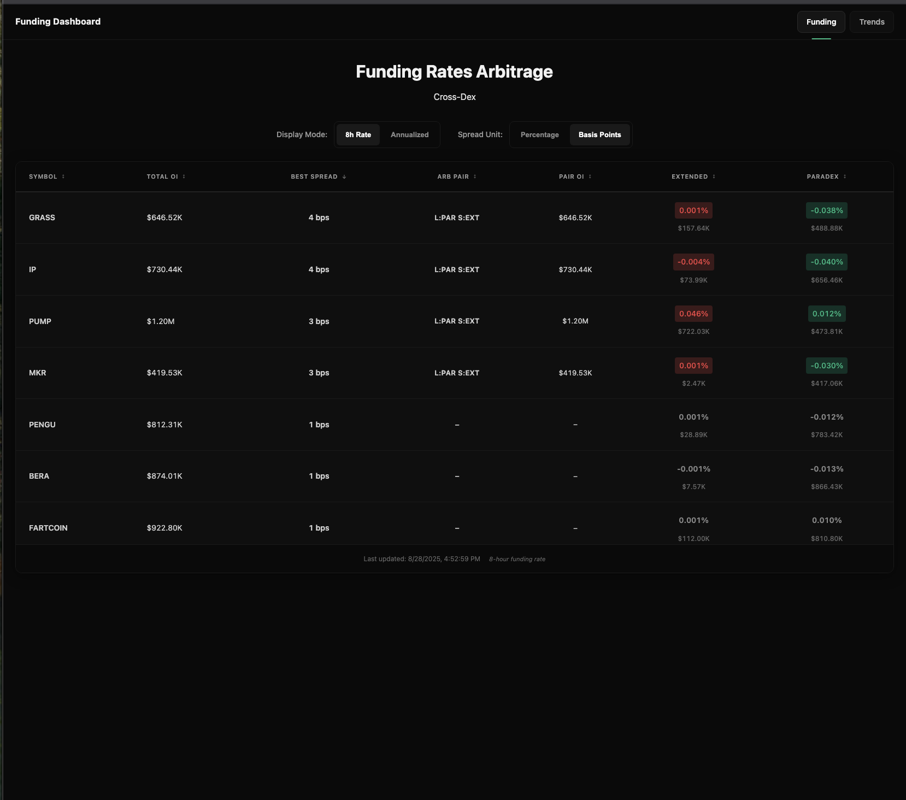

# Prerequisites
- **ClickHouse**.
- **Rust**.
- **Node.js and npm**.


# Setup Instructions
1. Database Configuration

1. Install ClickHouse and create a database (or use the auto-create defaults below).

2. Create a `.env` file in the project root:

```env

# .env file
CLICKHOUSE_URL=http://localhost:8123
CLICKHOUSE_DATABASE=crypto_db
CLICKHOUSE_USER=default
CLICKHOUSE_PASSWORD=

SYNC_CONC_MARKETS=30
SYNC_DB_CHUNK=60000

```


### 2. Backfilling the Database

To populate ClickHouse tables, use the `sync` binary.

```bash
Quick Backfill (All Tables)
cargo run --bin sync -- sync funding

Backfill for the Last 24 Hours
cargo run --bin sync -- sync funding --hours 24

Backfill Between Specific Timestamps
Use Unix timestamps (in milliseconds) to specify a range:

cargo run --bin sync -- sync funding --between 1724544000000 1724630400000
```


Target a Single Exchange
Add the `--exchange` flag to target a specific exchange (case-insensitive).


Backfill funding for one exchange:
```bash
cargo run --bin sync -- sync funding --exchange paradex --hours 168
```

Backfill trend data (daily klines):
```bash
cargo run --bin sync -- \
  sync trend \
  --exchange binance \
  --market-type perps \
  --days 120 \
  --source klines \
  --quote USDT
```

Backfill zscore data (hourly klines + trades):
```bash
cargo run --bin sync -- \
  sync zscore \
  --exchange binance \
  --market-type perps \
  --hours 36000 \
  --source both \
  --quote USDT
```


**Recommendation**: Use `cargo run --bin sync -- sync funding` for a full funding backfill unless specific data is needed.

# 3. Running the Backend
Start the backend after backfilling the database:

```bash
cargo run --bin backend
```


# 4. Running the Frontend

## Set up environment variables:
```env

# .env file
VITE_API_URL=http://localhost:8080
VITE_API_ENDPOINT=/api/funding/matrix
VITE_REFRESH_INTERVAL=30000

```


In a separate terminal, navigate to the `frontend` directory and run:
```bash
cd frontend
npm install
npm run dev
```


Extending to New Exchanges
To add support for a new exchange:
- Use the `--exchange` flag with the new exchange name in sync commands.
- Ensure the exchange is supported in the backend configuration.


# Notes
- Exchange names are case-insensitive.
- Verify the `.env` file has the correct ClickHouse settings.
- Sync workflows available: `funding`, `trend`, `zscore`, and `cex-add`.
- Writes are inserted in large chunks controlled by `SYNC_DB_CHUNK` and executed via async background insert workers.
- Refer to the project documentation or open an issue for support.


# Contributing
1. Fork the repository.
2. Create a new branch (`git checkout -b feature-name`).
3. Commit your changes (`git commit -m "Add feature"`).
4. Push to the branch (`git push origin feature-name`).
5. Open a pull request.

